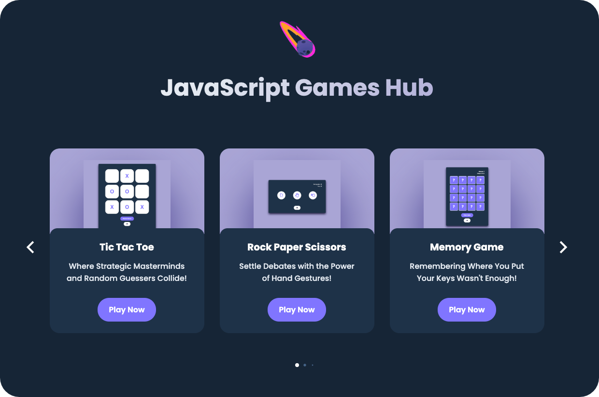

  

**JavaScript Games Hub** is a collection of browser-based mini-games developed using **Vanilla JavaScript**, **HTML**, and **CSS**, without relying on frameworks. It demonstrates strong proficiency in core web development technologies, focusing on clean, efficient, and maintainable code.

The project integrates the **SwiperJS library** to create a responsive, swipeable interface for seamless navigation between games. This allows for an enhanced user experience across devices, particularly mobile platforms.

**Key Highlights:**
- **Built with Vanilla JavaScript, HTML, and CSS** – ensuring lightweight, performant code.
- **SwiperJS integration** – provides a smooth and responsive game selection interface.
- **Modular structure** – allows easy addition of new games and future scalability.
- **Fully responsive design** – optimized for both desktop and mobile users.

This project is ideal for showcasing technical skills in front-end web development, emphasizing core competencies in JavaScript, responsive design, and UI/UX.

---
